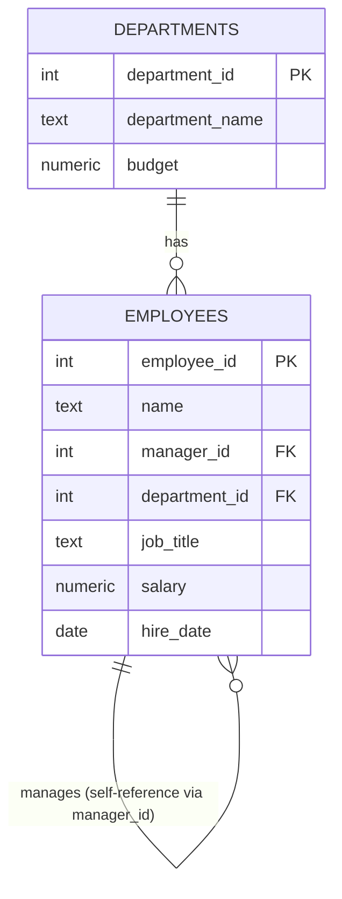

# Entity-Relationship Diagram

## Notes

- `employees.manager_id` self-references `employees.employee_id` — this is
  the self-referencing relationship the entire project's recursive CTEs
  are built around.
- The one employee with `manager_id IS NULL` (the CEO) is the root of the
  hierarchy — the anchor member for every top-down traversal in this project.
- `employees.department_id` is a flat attribute, independent of the
  reporting hierarchy — an employee's department doesn't change based on
  how many levels up their manager sits. This is why department rollups
  (Day 3/Day 5) and hierarchy rollups (Day 2/Day 3) are two genuinely
  different axes of aggregation over the same table.
